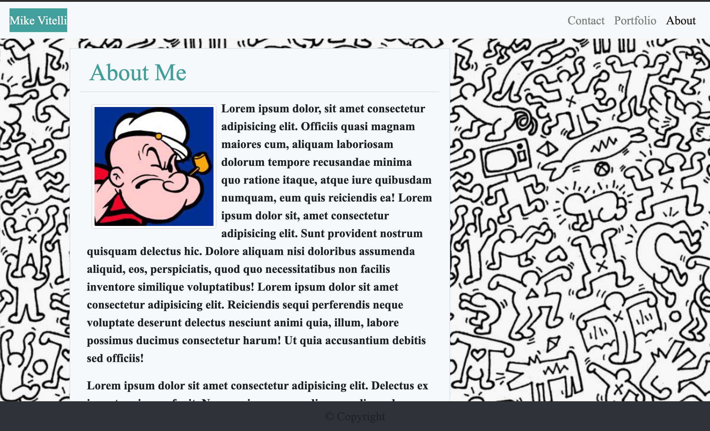
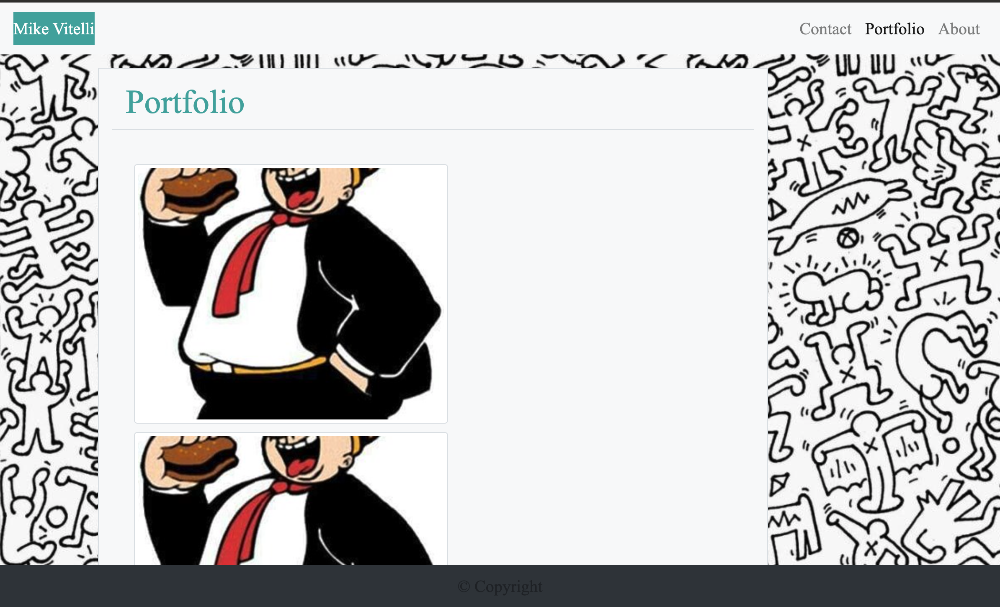
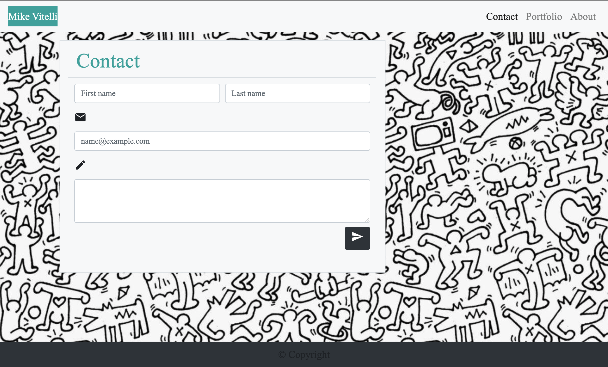

https://mikevitelli.github.io/responsivness-portfolio/

https://github.com/mikevitelli/responsivness-portfolio

# Responsive Web App

## Table of Contents

- [Installation](#installation)
- [Usage](#usage)
- [Credits](#credits)
- [License](#license)

## Installation

In order to experience my custom responsive web application, the user needs to open the link in their browser.

This is what it will look like:

Lorem ipsum dolor sit amet, consectetur adipiscing elit. Cras tristique, magna at consequat iaculis, lectus turpis mollis metus, in auctor urna sem non ligula. Nunc dignissim blandit est, ut eleifend augue bibendum tempus. Fusce tempus eu mi non aliquam. Sed imperdiet eros eget odio venenatis sagittis. Vestibulum quis mauris et nibh elementum commodo. Vestibulum ante ipsum primis in faucibus orci luctus et ultrices posuere cubilia curae; Etiam hendrerit condimentum nisi ac aliquam. Orci varius natoque penatibus et magnis dis parturient montes, nascetur ridiculus mus. Suspendisse eu elit elementum, volutpat ante et, posuere mi. Phasellus sit amet lacus in nunc bibendum blandit id malesuada est. Etiam at lectus risus. Praesent vitae vulputate nunc. Nam placerat nibh eget consequat viverra. Nunc mattis ligula in urna porta, sit amet faucibus mi congue. Nulla at porttitor nisi. Quisque volutpat ultrices leo, et mattis ligula pulvinar quis.

Maecenas luctus, augue quis rutrum pulvinar, massa dolor ullamcorper sapien, in consectetur metus leo nec mauris. Proin suscipit ligula libero, fermentum feugiat diam volutpat non. Nunc ac varius diam, in sodales ipsum. Morbi lectus nisl, malesuada ac purus at, pulvinar ultrices risus. Quisque sit amet velit eu lacus viverra imperdiet. Aliquam ullamcorper, ipsum at semper ullamcorper, ligula ligula hendrerit nibh, quis elementum nisi dolor a massa. Mauris pellentesque maximus odio interdum tincidunt. Praesent dapibus posuere dignissim. Nam sit amet est orci. Morbi bibendum sagittis odio, non auctor tellus finibus in. Integer cursus egestas purus nec convallis. Aliquam a nisi laoreet, ornare lacus a, molestie velit. Donec semper, tellus a pharetra consequat, risus nunc molestie orci, a laoreet dolor augue lobortis mauris. Curabitur molestie est sed bibendum consequat. Praesent feugiat mauris sit amet tincidunt mattis. Duis non magna hendrerit, egestas lacus nec, euismod nulla.

## Usage

Simply Navigate through the pages as you please.

Lorem ipsum dolor sit amet, consectetur adipiscing elit. Cras tristique, magna at consequat iaculis, lectus turpis mollis metus, in auctor urna sem non ligula. Nunc dignissim blandit est, ut eleifend augue bibendum tempus. Fusce tempus eu mi non aliquam. Sed imperdiet eros eget odio venenatis sagittis. Vestibulum quis mauris et nibh elementum commodo. Vestibulum ante ipsum primis in faucibus orci luctus et ultrices posuere cubilia curae; Etiam hendrerit condimentum nisi ac aliquam. Orci varius natoque penatibus et magnis dis parturient montes, nascetur ridiculus mus. Suspendisse eu elit elementum, volutpat ante et, posuere mi. Phasellus sit amet lacus in nunc bibendum blandit id malesuada est. Etiam at lectus risus. Praesent vitae vulputate nunc. Nam placerat nibh eget consequat viverra. Nunc mattis ligula in urna porta, sit amet faucibus mi congue. Nulla at porttitor nisi. Quisque volutpat ultrices leo, et mattis ligula pulvinar quis.

Maecenas luctus, augue quis rutrum pulvinar, massa dolor ullamcorper sapien, in consectetur metus leo nec mauris. Proin suscipit ligula libero, fermentum feugiat diam volutpat non. Nunc ac varius diam, in sodales ipsum. Morbi lectus nisl, malesuada ac purus at, pulvinar ultrices risus. Quisque sit amet velit eu lacus viverra imperdiet. Aliquam ullamcorper, ipsum at semper ullamcorper, ligula ligula hendrerit nibh, quis elementum nisi dolor a massa. Mauris pellentesque maximus odio interdum tincidunt. Praesent dapibus posuere dignissim. Nam sit amet est orci. Morbi bibendum sagittis odio, non auctor tellus finibus in. Integer cursus egestas purus nec convallis. Aliquam a nisi laoreet, ornare lacus a, molestie velit. Donec semper, tellus a pharetra consequat, risus nunc molestie orci, a laoreet dolor augue lobortis mauris. Curabitur molestie est sed bibendum consequat. Praesent feugiat mauris sit amet tincidunt mattis. Duis non magna hendrerit, egestas lacus nec, euismod nulla.

## Credits

This site was made from interpreting photos into code.

by mike vitelli.

Lorem ipsum dolor sit amet, consectetur adipiscing elit. Cras tristique, magna at consequat iaculis, lectus turpis mollis metus, in auctor urna sem non ligula. Nunc dignissim blandit est, ut eleifend augue bibendum tempus. Fusce tempus eu mi non aliquam. Sed imperdiet eros eget odio venenatis sagittis. Vestibulum quis mauris et nibh elementum commodo. Vestibulum ante ipsum primis in faucibus orci luctus et ultrices posuere cubilia curae; Etiam hendrerit condimentum nisi ac aliquam. Orci varius natoque penatibus et magnis dis parturient montes, nascetur ridiculus mus. Suspendisse eu elit elementum, volutpat ante et, posuere mi. Phasellus sit amet lacus in nunc bibendum blandit id malesuada est. Etiam at lectus risus. Praesent vitae vulputate nunc. Nam placerat nibh eget consequat viverra. Nunc mattis ligula in urna porta, sit amet faucibus mi congue. Nulla at porttitor nisi. Quisque volutpat ultrices leo, et mattis ligula pulvinar quis.

Maecenas luctus, augue quis rutrum pulvinar, massa dolor ullamcorper sapien, in consectetur metus leo nec mauris. Proin suscipit ligula libero, fermentum feugiat diam volutpat non. Nunc ac varius diam, in sodales ipsum. Morbi lectus nisl, malesuada ac purus at, pulvinar ultrices risus. Quisque sit amet velit eu lacus viverra imperdiet. Aliquam ullamcorper, ipsum at semper ullamcorper, ligula ligula hendrerit nibh, quis elementum nisi dolor a massa. Mauris pellentesque maximus odio interdum tincidunt. Praesent dapibus posuere dignissim. Nam sit amet est orci. Morbi bibendum sagittis odio, non auctor tellus finibus in. Integer cursus egestas purus nec convallis. Aliquam a nisi laoreet, ornare lacus a, molestie velit. Donec semper, tellus a pharetra consequat, risus nunc molestie orci, a laoreet dolor augue lobortis mauris. Curabitur molestie est sed bibendum consequat. Praesent feugiat mauris sit amet tincidunt mattis. Duis non magna hendrerit, egestas lacus nec, euismod nulla.

## License

Don't use this.

Lorem ipsum dolor sit amet, consectetur adipiscing elit. Cras tristique, magna at consequat iaculis, lectus turpis mollis metus, in auctor urna sem non ligula. Nunc dignissim blandit est, ut eleifend augue bibendum tempus. Fusce tempus eu mi non aliquam. Sed imperdiet eros eget odio venenatis sagittis. Vestibulum quis mauris et nibh elementum commodo. Vestibulum ante ipsum primis in faucibus orci luctus et ultrices posuere cubilia curae; Etiam hendrerit condimentum nisi ac aliquam. Orci varius natoque penatibus et magnis dis parturient montes, nascetur ridiculus mus. Suspendisse eu elit elementum, volutpat ante et, posuere mi. Phasellus sit amet lacus in nunc bibendum blandit id malesuada est. Etiam at lectus risus. Praesent vitae vulputate nunc. Nam placerat nibh eget consequat viverra. Nunc mattis ligula in urna porta, sit amet faucibus mi congue. Nulla at porttitor nisi. Quisque volutpat ultrices leo, et mattis ligula pulvinar quis.

Maecenas luctus, augue quis rutrum pulvinar, massa dolor ullamcorper sapien, in consectetur metus leo nec mauris. Proin suscipit ligula libero, fermentum feugiat diam volutpat non. Nunc ac varius diam, in sodales ipsum. Morbi lectus nisl, malesuada ac purus at, pulvinar ultrices risus. Quisque sit amet velit eu lacus viverra imperdiet. Aliquam ullamcorper, ipsum at semper ullamcorper, ligula ligula hendrerit nibh, quis elementum nisi dolor a massa. Mauris pellentesque maximus odio interdum tincidunt. Praesent dapibus posuere dignissim. Nam sit amet est orci. Morbi bibendum sagittis odio, non auctor tellus finibus in. Integer cursus egestas purus nec convallis. Aliquam a nisi laoreet, ornare lacus a, molestie velit. Donec semper, tellus a pharetra consequat, risus nunc molestie orci, a laoreet dolor augue lobortis mauris. Curabitur molestie est sed bibendum consequat. Praesent feugiat mauris sit amet tincidunt mattis. Duis non magna hendrerit, egestas lacus nec, euismod nulla.

# Unit 02 CSS and Bootstrap Homework: Responsive Portfolio

Responsive design ensures that web applications render well on a variety of devices and window or screen sizes. As a developer, you will likely be asked to create a mobile-first application or add responsive design to an existing application.

## Directions

First, you will use the Bootstrap CSS Framework to create a mobile responsive portfolio. How do you deliver this? Here are some guidelines:

- Create the following files files: `index.html`, `portfolio.html` and `contact.html`.

- Using Bootstrap, develop your portfolio site with the following items:

  - A navbar

  - A responsive layout

  - Responsive images

- The Bootstrap portfolio should minimize the use of media queries.

- Screenshots are provided as a reference in the `Assets/Images` folder. Your app does not need to be _exactly_ like the images. Use Bootstrap to create a similar, responsive layout.

### Hints

- Use Bootstrap's grid system (containers, rows, and columns).

- On an `xs` screen, content should take up the entire screen. On `sm` and larger screens, you should have some margins on the left and right sides of the screen. Check out various sites on your mobile device vs. your computer to see examples of these differences.

- Use an HTML validation service to ensure that each page has valid HTML.

### Minimum Requirements

- Functional, deployed application

- GitHub repository with README describing the project

- Navbar must be consistent on each page.

- Navbar on each page must contain links to Home/About, Contact, and Portfolio pages.

- All links must work.

- Must use semantic html.

- Each page must have valid and correct HTML. (use a validation service)

- Must contain your personalized information. (bio, name, images, links to social media, etc.)

- Must properly utilize Bootstrap components and grid system.

### Bonus

- Using Bootstrap, make a sticky footer and use sub-rows and sub-columns on your portfolio site (**Hint:** Check out the Bootstrap documentation).

## Commit Early and Often

One of the most important skills to master as a web developer is version control. Building the habit of committing via Git is important for two reasons:

- Your commit history is a signal to employers that you are actively working on projects and learning new skills.

- Your commit history allows you to revert your codebase in the event that you need to return to a previous state.

Follow these guidelines for committing:

- Make single-purpose commits for related changes to ensure a clean, manageable history. If you are fixing two issues, make two commits.

- Write descriptive, meaningful commit messages so that you and anyone else looking at your repository can easily understand its history.

- Don't commit half-done work, for the sake of your collaborators (and your future self!).

- Test your application before you commit to ensure functionality at every step in the development process.

We would like you to have well over 200 commits by graduation, so commit early and often!

## Submission on BCS

You are required to submit the following:

- The URLs of the deployed applications

- The URLs of the GitHub repositories
